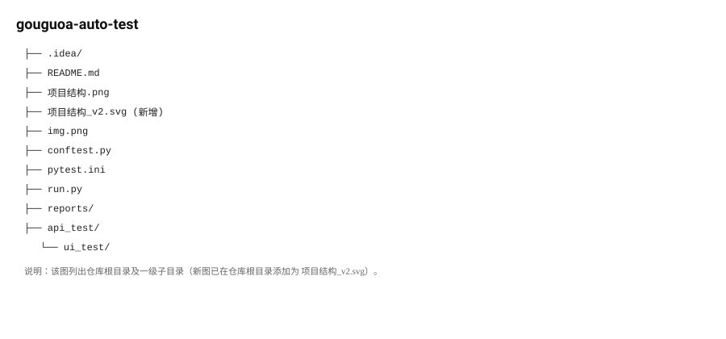

# gouguoa-auto-test

这是 gouguoa 的自动化测试仓库，使用 Python + pytest 作为主要测试框架，目标是构建稳定、可维护的接口与 UI 自动化测试套件。下面的说明已结合仓库现状编写。

> 注意：请勿在仓库中提交明文凭据或敏感信息，推荐使用环境变量或 CI Secrets 管理密钥与密码。

## 项目结构（当前）


```
├── api_test/               # 接口测试目录（请在此添加你的测试用例）
├── ui_test/                # UI 测试目录（请在此添加你的测试用例）
├── reports/                # 测试报告输出目录（pytest.ini 中配置为 ./reports/report.html）
├── conftest.py             # pytest 全局夹具（当前包含运行计时 fixture）
├── pytest.ini              # pytest 配置（addopts、testpaths、markers）
├── run.py                  # 示例脚本（用于演示登录/验证码尝试，请谨慎使用）
├── img.png                 # 项目图片示例
├── 项目结构.png            # 原项目结构图片（保留）
└── README.md               # 本文件
```

## 依赖与运行环境

- 推荐使用 Python 3.8+（或与项目中指定版本一致）。
- 建议使用虚拟环境管理依赖：

```bash
python -m venv .venv
# macOS / Linux
source .venv/bin/activate
# Windows (PowerShell)
.\.venv\Scripts\Activate.ps1
# 安装依赖（若有 requirements.txt）
pip install -r requirements.txt
```

如果你还没有 requirements.txt，请将项目依赖写入该文件以便在 CI 中统一安装。

## 使用 pytest 运行测试

仓库已包含 `pytest.ini`，主要配置项包括：addopts（默认生成 HTML 报告、并行执行 -n 7）、testpaths（默认扫描 ./api-test/test_cases 和 ./ui-test/test_cases，本仓库以实际目录为准）。

在仓库根目录运行：

```bash
# 运行全部测试（会使用 pytest.ini 中的 addopts）
pytest

# 或运行单个测试文件
pytest api_test/test_example.py
```

生成的报告默认输出到 `./reports/report.html`（由 pytest.ini 的 --html 参数控制）。

## 关于 run.py

仓库包含一个示例脚本 `run.py`，其逻辑会向 `http://192.168.198.129:81` 发起请求并尝试多次带验证码的登录。该脚本仅作演示使用：

- 请不要在公网或非测试环境运行。
- 若用于调试，请先确认目标环境允许此类请求并使用合适的账户信息。

## 配置与敏感信息管理

- 推荐使用 `.env` 或专门的配置文件（例如 config.yml）保存环境相关配置，并把敏感信息加入 `.gitignore`。
- 在 CI（例如 GitHub Actions）中使用 Secrets 管理凭证。

示例环境变量：

```bash
export TEST_ENV=staging
export API_KEY=xxxxxx
```

## CI 集成（示例：GitHub Actions）

下面是一个简单的 GitHub Actions 流程示例（按需修改 Python 版本和安装命令）：

```yaml
name: CI

on: [push, pull_request]

jobs:
  test:
    runs-on: ubuntu-latest
    steps:
      - uses: actions/checkout@v3
      - name: Set up Python
        uses: actions/setup-python@v4
        with:
          python-version: '3.10'
      - name: Install dependencies
        run: |
          python -m pip install --upgrade pip
          pip install -r requirements.txt
      - name: Run tests
        run: pytest
      - name: Upload report
        uses: actions/upload-artifact@v4
        with:
          name: test-report
          path: reports/report.html
```

## 报告与日志

推荐使用 Allure、pytest-html 等工具生成更丰富的测试报告，并将 reports 目录作为构建产物上传保留执行记录。

## 贡献

欢迎贡献代码、测试用例与用例模板：

1. Fork 本仓库
2. 新建分支：git checkout -b feature/xxx
3. 提交并推送：git commit -m "feat: 描述你的改动" && git push
4. 发起 Pull Request，说明变更目的与验证方式

## 许可证

该仓库当前未指定具体开源协议。若需要公开发布，请添加 LICENSE 文件（例如 MIT、Apache-2.0 等）。

## 联系方式

如有问题请联系维护者：@F1ee987
